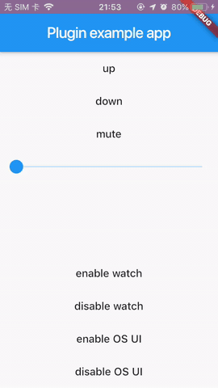

# flutter_volume

A flutter plugin for volume control and monitoring, support iOS and Android

手把手带你写 Flutter 系统音量插件
https://www.yuque.com/befovy/share/flutter_volume





If you have problems about kotlin environment. Maybe you should add next codes in your android root project build.gradle.

```
buildscript {
    ext.kotlin_version = '1.3.72'
    repositories {
        google()
        jcenter()
    }

    dependencies {
        classpath 'com.android.tools.build:gradle:3.2.1'
        classpath "org.jetbrains.kotlin:kotlin-gradle-plugin:$kotlin_version"
    }
}
```

## Declaration

This repo is created for example about how to create a flutter plugin.

I don't want this repo to be used in productive environment.  
If someone want use this as a volume plugin, please fork and make your own publish.
